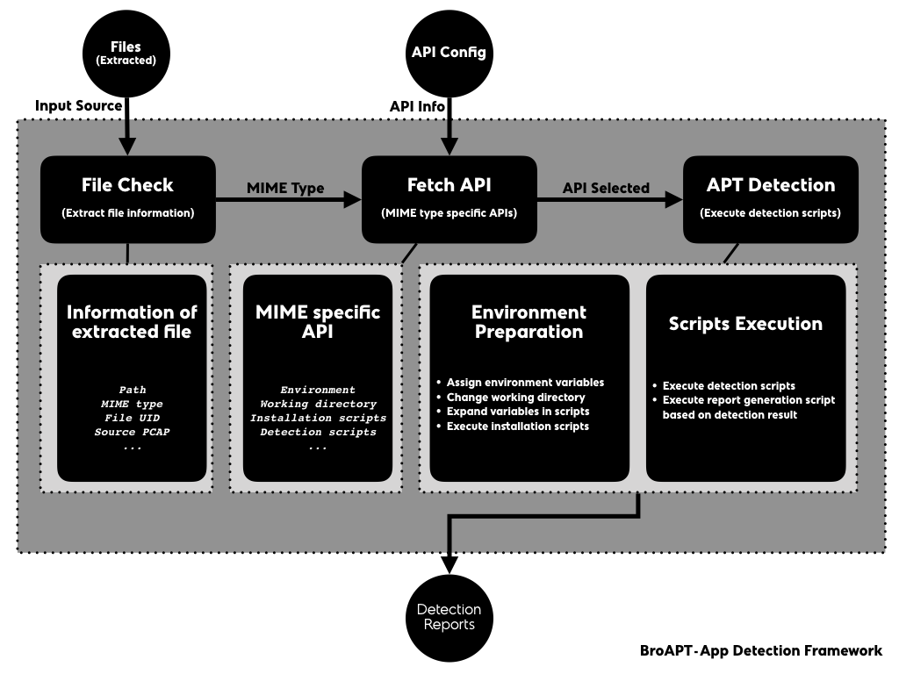

BroAPT-App Detection Framework
==============================

The BroAPT-App framework processes extracted files, perform malware detection
upon those files with detection API configured through the configuration file.

0. The BroAPT-App framework fetches basic information about the extracted file,
   including file path, MIME type, file UID, source PCAP file, etc.

   Each file extracted, since it will be named after::

      PROTOCOL-FUID-MIMETYPE.EXT

   with such pattern, the BroAPT-App framework will generate an ``Entry`` to
   represent the information of the target file, e.g. for a extracted file
   named::

      application/vnd.openxmlformats-officedocument/HTTP-F3Df5B3z9UI3yi5J03.application.msword.docx

   the BroAPT-App framework will generate the ``Entry`` object as following:

   .. code:: python

      Entry(
          path='application/vnd.openxmlformats-officedocument/HTTP-F3Df5B3z9UI3yi5J03.application.msword.docx',
          uuid='F3Df5B3z9UI3yi5J03',
          mime=MIME(
              media_type='application',
              subtype='msword',
              name='application/msword'
          )
      )

1. Based on the MIME type, the BroAPT-App framework will obtain MIME specific
   detection API for the extracted file.
2. The BroAPT-App framework will then start detecting the extracted file based
   on the specification described in the API.

   When detection, as the Docker container may not be capable of such action,
   the BroAPT-App framework may request the BroAPT-Daemon server to *remote*
   detect the extracted file.

   .. image:: _image/BroAPT/BroAPT.010.png
      :alt: BroAPT Client-Server Detection Framework

   The BroAPT-Daemon server is a RESTful API server implemented using `Flask`_
   microframework. At the moment it supports following APIs:

   ======================================== =========== ==========================
   URI Routing                              HTTP Method Description
   ======================================== =========== ==========================
   ``/api/v1.0/list``                       ``GET``     Query detection listing
   ``/api/v1.0/report/<id>``                ``GET``     Query detection report
   ``/api/v1.0/scan data={"key": "value"}`` ``POST``    Request *remote* detection
   ``/api/v1.0/delete/<id>``                ``DELETE``  Delete detection record
   ======================================== =========== ==========================

   .. _Flask: https://flask.palletsprojects.com

-------------------------------
MIME Specific API Configuration
-------------------------------

In the BroAPT-App framework, we used an API configuration file to provide the BroAPT
system with MIME specific detection mechanism. The configuration file is written in
YAML, inspired by Docker Compose and Travis CI.

The directory structure of API configuration file and its related files are as below::

   /api/
   │   # API configuration file
   ├── api.yml
   │   # MIME: application/*
   ├── application/
   │   └── ...
   │   # MIME: audio/*
   ├── audio/
   │   └── ...
   │   # default API
   ├── example/
   │   └── ...
   │   # MIME: font/*
   ├── font/
   │   └── ...
   │   # MIME: image/*
   ├── image/
   │   └── ...
   │   # MIME: message/*
   ├── message/
   │   └── ...
   │   # MIME: model/*
   ├── model/
   │   └── ...
   │   # MIME: multipart/*
   ├── multipart/
   │   └── ...
   │   # MIME: text/*
   ├── text/
   │   └── ...
   │   # MIME: video/*
   └── video/
      └── ...

The ``/api/`` folder will be mapped into the Docker container at runtime and the
``/api/api.yml`` is the exact API configuration file. The API for ``example`` MIME
type is the default fallback detection method for those with **NO** existing detection
API configured.

In the configuration file, you can specify global environment variables under the
``environment`` key:

.. code:: yaml

   environment:
     # API root path (from environment vairable)
     API_ROOT: ${BROAPT_API_ROOT}
     # Python 3.6
     PYTHON36: /usr/bin/python3.6
     # Python 2.7
     PYTHON27: /usr/bin/python
     # Shell/Bash
     SHELL: /bin/bash

And for a certain MIME, e.g. PDF files (MIME is ``application/pdf``), the configuration
should be as following:

.. code:: yaml

   application:
     pdf:
       remote: false
       # default working directory is ``/api/application/pdf/``
       # now changed to ``/api/application/pdf/pdf_analysis``
       workdir: pdf_analysis
       environ:
         ENV_FOO: 1
         ENV_BAR: cliche
       install:
         - apt-get update
         - apt-get install -y python python-pip
         - ${PYTHON27} -m pip install -r requirements.txt
         - rm -rf /var/lib/apt/lists/*
         - apt-get remove -y --auto-remove python-pip
         - apt-get clean
       scripts:
         - ${PYTHON27} detect.py [...]
         - ...
       report: ${PYTHON27} report.py

.. note::

   *Shell*-like globing is now supported for MIME types, you may specify an API
   using ``application/vnd.ms-*``, which will be used for both ``application/vnd.ms-excel``
   and ``application/ms-powerpoint``.

   In the configuration file, the ``report`` key is mandatory.

   If set ``remote`` key as ``true``, the BroAPT-App framework will request the
   BroAPT-Daemon server to perform *remote* detection.

   And if an API configuration is shared by multiple MIME types, you should set
   ``shared`` key as ``true``, so that the API would be *process-safe* at runtime.

After parsing through the :func:`cfgparser.parse` function, the API configuration
above will be represented as:

.. code:: python

   API(
       workdir='pdf_analysis',
       environ={
          'API_ROOT': '${BROAPT_API_ROOT}',
          'PYTHON36': '/usr/bin/python3.6',
          'PYTHON27': '/usr/bin/python',
          'SHELL': '/bin/bash',
          'ENV_FOO': '1',
          'ENV_BAR': 'cliche'
       },
       install=[
          'apt-get update',
          'apt-get install -y python python-pip',
          '${PYTHON27} -m pip install -r requirements.txt',
          'rm -rf /var/lib/apt/lists/*',
          'apt-get remove -y --auto-remove python-pip',
          'apt-get clean'
       ],
       scripts=[
          '${PYTHON27} detect.py [...]',
          ...
       ],
       report='${PYTHON27} report.py',
       remote=False,
       shared='application/pdf',
       inited=<Synchronized wrapper for c_ubyte(0)>,
       locked=<Lock(owner=unknown)>
   )

* ``API.inited`` is to mark if the installation process had been run successfully.
* ``API.shared`` is to mark if the configuration is shared by multiple MIME types.
* ``API.locked`` is to mark if the process is locked to prevent resource competition.

At runtime, if the BroAPT-App framework is to detect a file at ``/dump/application/pdf/test.pdf``,
the main procedure is as follows:

0. Set environment variables:

   .. code:: shell

      API_ROOT="/api/"
      PYTHON36="/usr/bin/python3.6"
      PYTHON27="/usr/bin/python"
      SHELL="/bin/bash"
      ENV_FOO=1
      ENV_BAR="cliche"
      BROAPT_PATH="/dump/application/pdf/test.pdf"
      BROAPT_MIME="application/pdf"

1. Change the current working directory to ``/api/application/pdf/pdf_analysis``.
2. If the ``API.inited`` is now ``False``, which means the installation process is
   **NOT** yet performed, then acquire ``API.locked`` and execute the commands:

   .. code:: shell

      apt-get update
      apt-get install -y python python-pip
      python -m pip install -r requirements.txt
      rm -rf /var/lib/apt/lists/*
      apt-get remove -y --auto-remove python-pip
      apt-get clean

   afterwards, toggle ``API.inited`` to ``True`` and release ``API.locked``.
3. Execute detection commands:

   .. code:: shell

      /usr/bin/python detect.py [...]
      ...

4. Once finished, execute report generation script ``/usr/bin/python report.py``.

-----------------------------
Integrated Detection Services
-----------------------------

At the moment, the BroAPT system had integrated six detection solusions.

Default Detection powered by VirusTotal
---------------------------------------

`VirusTotal`_ aggregates many antivirus products and online scan engines to check
for viruses that the user's own antivirus may have missed, or to verify against
any false positives.

.. _VirusTotal: https://www.virustotal.com

As mentioned above, the ``example`` MIME type is the default fallback detection
mechanism in case of missing configuration. The configuration is as below:

.. code:: yaml

   example:
     environ:
       ## sleep interval
       VT_INTERVAL: 30
       ## max retry for report
       VT_RETRY: 10
       ## percentage of positive threshold
       VT_PERCENT: 50
       ## VT API key
       VT_API: ...
       ## path to VT file scan reports
       VT_LOG: /var/log/bro/tmp/
     report: ${PYTHON36} virustotal.py

Android APK Detection powered by AndroPyTool
--------------------------------------------

`AndroPyTool`_ is a tool for extracting static and dynamic features from Android
APKs. It combines different well-known Android apps analysis tools such as DroidBox,
FlowDroid, Strace, AndroGuard or VirusTotal analysis. Provided a source directory
containing APK files, AndroPyTool applies all these tools to perform pre-static,
static and dynamic analysis and generates files of features in JSON and CSV formats
and also allows to save all the data in a MongoDB database.

.. _AndroPyTool: https://github.com/alexMyG/AndroPyTool

AndroPyTool is configured for detection APK files, whose MIME type is
``application/vnd.android.package-archive`` in IANA registry.  The configuration
is as below:

.. code:: yaml

   application:
     vnd.android.package-archive:
       remote: true
       workdir: AndroPyTool
       environ:
         APK_LOG: /home/traffic/log/bro/tmp/
       install:
         - docker pull alexmyg/andropytool
       report: ${SHELL} detect.sh

Since the environment configuration of AndroPyTool is much too complex,
we directly used its official Docker image for detection. Therefore, the AndroPyTool
is called through *remote* detection mechanism, i.e. BroApt-Daemon server performs
detection using AndroPyTool Docker image on APK files then send the report back to
BroAPT-App framework for records.

Office Document Detection powered by MaliciousMacroBot
------------------------------------------------------

Linux ELF Detection powered by ELF Parser
-----------------------------------------

Common Linux Malware Detection powered by LMD
---------------------------------------------

Malicious JavaScript Detection powered by JaSt
----------------------------------------------
