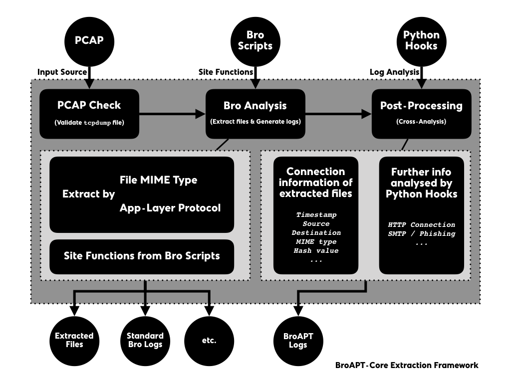

===============
Basic Framework
===============

The BroAPT system is generally designed in two main parts, as we described in the
:doc:`introduction </index>`, the core functions and the daemon server with its
command line interface (CLI).

.. image:: _image/BroAPT/BroAPT.003.png
   :alt: BroAPT Framework

On the host machine, the BroAPT-Daemon server runs as a manager of the BtoAPT
system, which watches the running status of underlying BroAPT core functions,
i.e. BroAPT-Core and BroAPT-App frameworks, as well as perform *remote* detection
upon API requests from detection framework.

In the docker containers, the BroAPT-Core and BroAPT-App frameworks perform
the core functions of BroAPT system. They analyse source PCAP files and extract
files transferred through the traffic with `Bro IDS`_, then detect the extracted
files based on MIME type specifically configured APT detection methods.

.. _Bro IDS: https://www.zeek.org

The general process of processing is as following:

.. image:: _image/BroAPT/BroAPT.005.png
   :alt: BroAPT Multiprocessing Framework

0. When the BroAPT-Core framework first reads a new PCAP file, it will utilise
   Bro IDS to process it, extract files transferred and perform other actions
   as configured through the Bro site functions.
1. As files had been extracted, the BroAPT-App framework will perform malware
   detection on each file. If *remote* detection configured, it will send an
   API request to the BroAPT-Daemon server, and wait for its detection report.
2. At the same time, once the Bro processing had finished, the BroAPT-Core
   framework will start processing the generated logs, and perform extra analysis
   over the Bro log files as specified by the Python hooks.
3. When the BroAPT-Daemon receives an API request, it will perform malware
   detection as described in the request, and send the detection report
   back to the BroAPT-App framework.

BroAPT-Core Extration Framework
===============================

The BroAPT-Core framework processes PCAP files, extracts files transferred
through traffic contained in the PCAP files, and perform analysis to the log
files generated by Bro scripts.

0. When the BroAPT-Core framework first reads in a new PCAP file, it will
   validate if it's a valid |tcpdump|_ (:manpage:`tcpdump(1)`) format file,
   through |libmagic|_ (:manpage:`libmagic(3)`).
1. If validated, the BroAPT-Core framework will utilise the Bro IDS to
   perform analysis upon the PCAP file, extracting files and generating logs.

   When extracting, you may toggle through :doc:`environment variables <configuration>`
   to configure which MIME types and/or what application layer protocol files
   transferred with should be extracted.

   Also, site functions from user-defined Bro scripts will be loaded and executed
   at the same time.

   This step will produce extracted files and standard Bro logs, as well as
   extra artefacts elevated through the site functions.
2. Later, the BroAPT-Core framework will perform post-processing, a.k.a.
   cross-analysis, upon the logs generated in previous step.

   By default, the BroAPT-Core framework will gather connection information
   of the extracted files from the Bro logs (``files.log``). Some other analysis
   will also be performed as defined in the Python hooks.

   The result of analysis will be elevated as BroAPT logs.

.. |tcpdump| replace:: ``tcpdump``
.. _tcpdump: https://www.tcpdump.org
.. |libmagic| replace:: ``libmagic``
.. _libmagic: https://pypi.org/project/python-libmagic

----------------------
Customised Bro Scripts
----------------------

In the BroAPT system, you can customise your own Bro script. The BroAPT-Core
framework will load those scripts when running Bro IDS to process PCAP files.

User defined Bro scripts will be mapped into the Docker container at runtime.
The directory structure would be as following:

.. code:: text

   /broapt/scripts/
   │   # load FileExtraction module
   ├── __load__.bro
   │   # configurations
   ├── config.bro
   │   # MIME-extension mappings
   ├── file-extensions.bro
   │   # protocol hooks
   ├── hooks/
   │   │   # extract DTLS
   │   ├── extract-dtls.bro
   │   │   # extract FTP_DATA
   │   ├── extract-ftp.bro
   │   │   # extract HTTP
   │   ├── extract-http.bro
   │   │   # extract IRC_DATA
   │   ├── extract-irc.bro
   │   │   # extract SMTP
   │   └── extract-smtp.bro
   │   # core logic
   ├── main.bro
   │   # MIME hooks
   │── plugins/
   │   │   # extract all files
   │   ├── extract-all-files.bro
   │   │   # extract APK
   │   ├── extract-application-vnd-android-package-archive.bro
   │   │   # extract PDF
   │   ├── extract-application-pdf.bro
   │   │   # extract PE
   │   ├── extract-application-vnd-microsoft-portable-executable.bro
   │   │   # extract by BRO_MIME
   │   └── extract-white-list.bro
   │   # site functions by user
   └── sites/
      │   # load site functions
      ├── __load__.bro
      └── ...

where ``extract-application-vnd-android-package-archive.bro``,
``extract-application-pdf.bro`` and
``extract-application-vnd-microsoft-portable-executable.bro`` are Bro scripts
generated automatically by the BroAPT-Core framework based on the
:envvar:`BROAPT_LOAD_MIME` environment vairable.

.. note::

   The :envvar:`BROAPT_LOAD_MIME` supports UNIX *shell*-like pattern matching,
   c.f. |fnmatch|_ module from Python.

   .. |fnmatch| replace:: ``fnmatch``
   .. _fnmatch: https://docs.python.org/3/library/fnmatch.html

And ``/broapt/scripts/sites/`` are mapped from the host machine, which includes
the Bro scripts defined by user. You may include your scripts into the
BroAPT-Core framework by loading (``@load``) them in the
``/broapt/scripts/sites/__load__.bro`` file.

At the moment, we have six sets of Bro scripts included in the distribution.

Common Constants
----------------

In the BroAPT system, it predefines many constants of common protocols and
systems, such as FTP commands, HTTP methods, etc. We used crawlers to fetch
relevant data from the IANA registry, generate and/or update Bro constants,
such as ``HTTP::header_names`` for HTTP headers fields.

HTTP Cookies
------------

The script utilised |http_header|_ event, and extends the builtin ``http.log``
record object |HTTP.Info|_ with data from the ``COOKIE`` header.

.. |http_header| replace:: ``http_header``
.. _http_header: https://docs.zeek.org/en/current/scripts/base/bif/plugins/Zeek_HTTP.events.bif.zeek.html#id-http_header
.. |HTTP.Info| replace:: ``HTTP::Info``
.. _HTTP.Info: https://docs.zeek.org/en/current/scripts/base/protocols/http/main.zeek.html#type-HTTP::Info

Unknown HTTP Headers
--------------------

As defined in :rfc:`2616` and :rfc:`7230`, and registered in IANA, there're a
list of known HTTP headers. However, customised headers may be introduced when
implementation. Such unknown headers may contain significant information about
the HTTP traffic. Therefore, the script utilised |http_header|_ event and
search for unknown headers, i.e. not included in ``HTTP::header_names``, then
record them in the ``http.log`` files.

HTTP ``POST`` Data
------------------

As :rfc:`2616` suggests, we can utilise the data sent from ``POST`` command
to analyse information about outbound traffic. The script utilised
|http_entity_data|_ event, and save the ``POST`` data to ``http.log`` files.

.. |http_entity_data| replace:: ``http_entity_data``
.. _http_entity_data: https://docs.zeek.org/en/current/scripts/base/bif/plugins/Zeek_HTTP.events.bif.zeek.html#id-http_entity_data

Calculate Hash Values
---------------------

Hash value of files can be used to detect malware. The script utilised
|file_new|_ event, calculated and saved the hash values of files transferred
in the ``files.log`` file.

.. |file_new| replace:: ``file_new``
.. _file_new: https://docs.zeek.org/en/current/scripts/base/bif/event.bif.zeek.html#id-file_new

SMTP Phishing Detect
--------------------

Since files transferred through SMTP traffic are not easy to gather and detect
phishing information. We introduced two Bro modules to perform such detection
on the SMTP traffic.

A. |Phishing|_ Module
~~~~~~~~~~~~~~~~~~~~~

The |Phishing|_ module mainly provides mass scam emails; phishing email detection
based on Levenshtein distance of sender address. It will elevate a
``phishing_link.log`` log file, containing such malicious connections and URLs.

.. |Phishing| replace:: ``Phishing``
.. _Phishing: https://github.com/hosom/bro-phishing

B. |Phish|_ Module
~~~~~~~~~~~~~~~~~~

Primary scope of these bro policies is to give more insights into smtp-analysis
esp to track phishing events.

This is a subset of phish-analysis repo and doesn't use any backed ``postgres``
database. So relieves the user from ``postgres`` dependency while getting
basic phishing detection up and running very quickly.

.. |Phish| replace:: ``Phish``
.. _Phish: https://github.com/initconf/smtp-url-analysis

-----------------------
Customised Python Hooks
-----------------------

In the BroAPT system, you can customise your own Python hooks for cross-analysis
to the log files. The BroAPT-Core framework will call such registered hooks on
each set of log files generacted from a PCAP file after processing of Bro.

.. seealso::

   Log analysis and generation can be done through the `ZLogging`_ project,
   which provides both loading and dumping interface to the processing of
   Bro logs.

   .. _ZLogging: https://zlogging.jarryshaw.me

User defined Bro scripts will be mapped into the Docker container at runtime.
The directory structure would be as following:

.. code:: text

   /broapt/python/
   │   # setup PYTHONPATH
   ├── __init__.py
   │   # entry point
   ├── __main__.py
   │   # config parser
   ├── cfgparser.py
   │   # Bro script composer
   ├── compose.py
   │   # global constants
   ├── const.py
   │   # Bro log parser
   ├── logparser.py
   │   # BroAPT-Core logic
   ├── process.py
   │   # multiprocessing support
   ├── remote.py
   │   # BroAPT-App logic
   ├── scan.py
   │   # Python hooks
   ├── sites
   │   │   # register hooks
   │   ├── __init__.py
   │   └── ...
   │   # utility functions
   └── utils.py

where ``/broapt/python/sites/`` is mapped from the host machine, which includes
user-defined site customisation Python hooks.

You can register your own hooks in the ``/broapt/python/sites/__init__.py``,
by importing (``import``) them and add them to the ``HOOK`` and/or ``EXIT``
registry lists.

In the ``HOOK`` registry, each registered hook function will be called after
a PCAP file is processed by the Bro IDS, and perform analysis on the logs
generated from the PCAP file.

.. note::

   The hook function will be called with **ONE** argument, ``log_name``, a
   string (``str``) representing the folder name to the target logs.

In the ``EXIT`` registry, each registered hook function will be called before
the main process of the BroAPT-Core framework exits.

.. note::

   The hook function will be called with **NO** argument.

At the moment, we have bundled two sets of Python hooks in the system.

Extracted File Information
--------------------------

HTTP Connection Information
---------------------------
