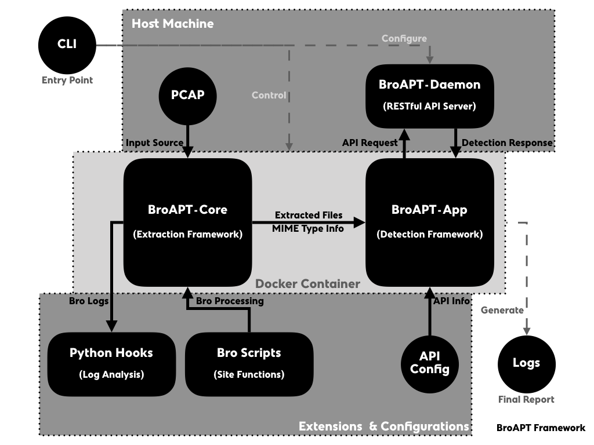
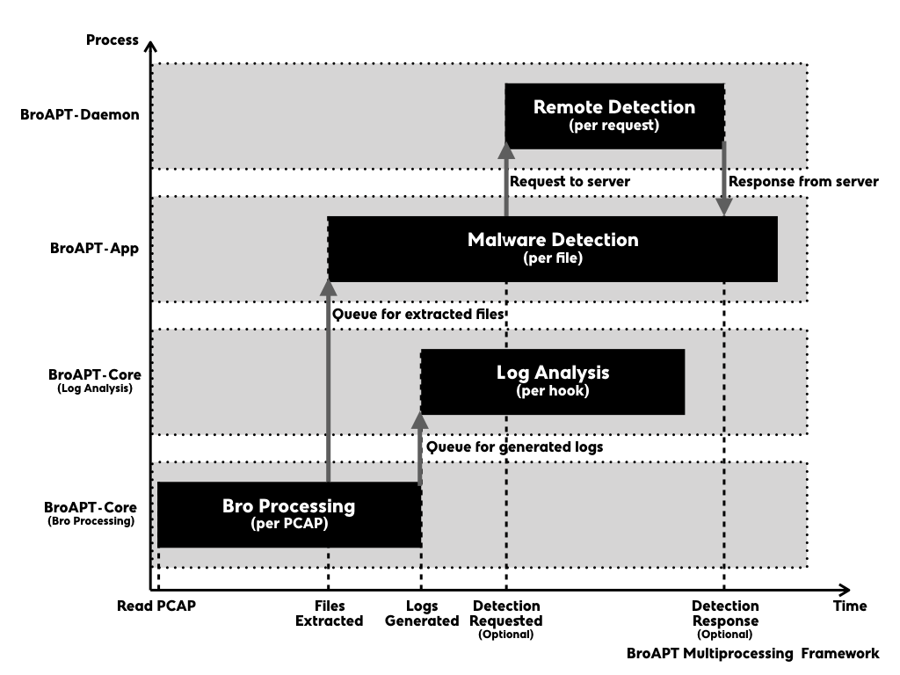

===================
Internal Frameworks
===================

.. toctree::
   :maxdepth: 3

   broapt-core
   broapt-app

The BroAPT system is generally designed in two main parts, as we described in the
:doc:`introduction </index>`, the core functions and the daemon server with its
command line interface (CLI).

On the host machine, the BroAPT-Daemon server runs as a manager of the BtoAPT
system, which watches the running status of underlying BroAPT core functions,
i.e. BroAPT-Core and BroAPT-App frameworks, as well as perform *remote* detection
upon API requests from detection framework.

In the docker containers, the BroAPT-Core and BroAPT-App frameworks perform
the core functions of BroAPT system. They analyse source PCAP files and extract
files transferred through the traffic with `Bro IDS`_, then detect the extracted
files based on MIME type specifically configured APT detection methods.

.. _Bro IDS: https://www.zeek.org

The general process of processing is as following:

0. When the BroAPT-Core framework first reads a new PCAP file, it will utilise
   Bro IDS to process it, extract files transferred and perform other actions
   as configured through the Bro site functions.
1. As files had been extracted, the BroAPT-App framework will perform malware
   detection on each file. If *remote* detection configured, it will send an
   API request to the BroAPT-Daemon server, and wait for its detection report.
2. At the same time, once the Bro processing had finished, the BroAPT-Core
   framework will start processing the generated logs, and perform extra analysis
   over the Bro log files as specified by the Python hooks.
3. When the BroAPT-Daemon receives an API request, it will perform malware
   detection as described in the request, and send the detection report
   back to the BroAPT-App framework.

----------------------
Implementation Details
----------------------

In first draft design, the BroAPT system was implemented in a cluster manner,
comparing to current bundled distribution, i.e. the BroAPT-Core framework and
BroAPT-App framework are two separate Docker containers. However, two
implementation manners are both maintained at the moment.

.. note::

   In the documentation, we normally refer to bundled implementation when
   talking about the BroAPT system internal implementation details.

Through internal module name may vary between two implementations, the main
implementation source codes is, nevertheless, identical in both implementations.

Cluster Implementation
----------------------

.. note::

   For source codes, please go to |source|_ folder.

   .. |source| replace:: ``/source/``
   .. _source: https://github.com/JarryShaw/BroAPT/tree/master/source/

In the cluster implementation, the BroAPT-Core framework is running in a
CentOS 7 container, as the then-latest version of Bro IDS (version 2.6.1) was
only available through RPM binary; whilst the BroAPT-App framework is running
is in an Ubuntu 16.04 container, with better compatibility for detection tools.

The communication between two frameworks is archived through file system
temporary listing files.

Bundled Implementation
----------------------

.. note::

   For source codes, please go to |cluster|_ folder.

   .. |cluster| replace:: ``/cluster/``
   .. _cluster: https://github.com/JarryShaw/BroAPT/tree/master/cluster/

In the bundled implementation, both the BroAPT-Core framework and the
BroAPT-App framework are running in a CentOS 7 container.

The communication between two frameworks is archived through |Queue|_.

.. |Queue| replace:: ``multiprocessing.Queue``
.. _Queue: https://docs.python.org/3/library/multiprocessing.html#multiprocessing.Queue
